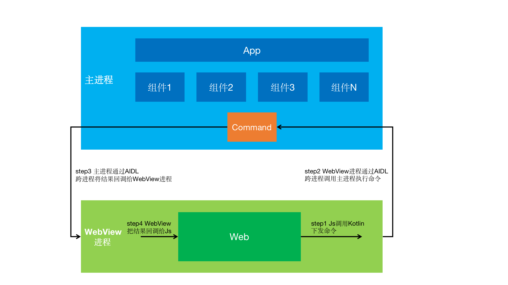

# MentosWeb


**一款轻巧而又功能强大的Android WebView，使用命令模式，@AutoService实现业务层，AIDL跨进程通信，支持JsBridge，具备强大的扩展能力。**

#### 功能

* MentosWeb独立进程，使用AIDL通信，降低OOM。
* 支持JsBridge，在业务层实现接口即可和js进行交互，扩展性极强。
* 支持进度条、下拉刷新、定制背景(开发中)、定制状态栏(开发中)、状态页切换(开发中)。

#### 演示


#### 使用

##### 1、gradle引入依赖

```
repositories {
    ...
    mavenCentral()
}
```

```
implementation 'io.github.exciter-z:mentosweb:1.0.0'
```

##### 2、添加权限

```
<uses-permission android:name="android.permission.INTERNET" />
<uses-permission android:name="android.permission.ACCESS_NETWORK_STATE" />
```

##### 3、业务层实现

web传入命令和参数 示例：`openPage`为命令，`{targetPage:page}`为参数

```
function openNativePage(page){
      mentosWeb.invokeNativeAction("openPage",{targetPage:page})
}
```

native继承Command处理命令

```
@AutoService(Command::class)
class OpenPageCommand : Command {
    override fun name(): String {
        return "openPage"
    }

    override fun execute(
        parameters: Map<*, *>,
        callback: ICallbackFromMainprocessToWebViewProcessInterface?
    ) {
        //todo 处理业务逻辑
    }
}
```

#### 架构



#### 类图

